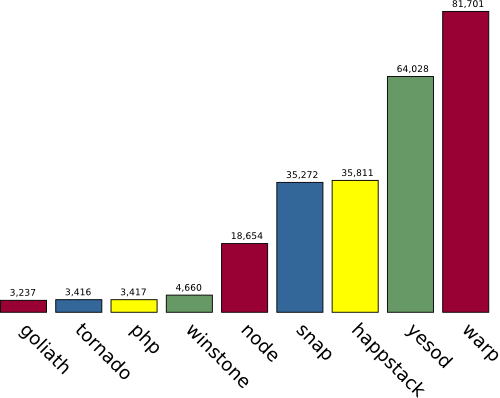

## Motivation

----

- we both live in shared flats
- these get pretty messy from time to time
- old solution don't work very well

----


----

Disadvantages of cleaning schedules

- missing overview
- requires a pen on hand
- can't be checked remotely
- _"I'll do it Tomorrow / on Sunday!"_
- static

----

The solution: `flatr`

- portable mobile & web-application
- can be checked from any smartphone
- sends reminders
- tasks need to be done in a short timeframe
- fair distribution of tasks

----

1. A user gets a push notification on their smartphone _(not implemented)_
   - contaning a specifc timeframe
2. The task gets done
3. Task gets marked as done in the application

A penalty for overdue tasks could be easily introduced

----

Highly configurable

- Title
- Description
- Frequency in times / week
- Completion time in hours
- Users per Task

Task overview can be printed as PDF (through the browser print menu)

----

Invite system

- not everyone should be able to join a flat
- first user can invite other users
- these users get a Email with an invite link
- then they are able to signup for a new account

----

Project organization

|                     |                                                                |
|---------------------+----------------------------------------------------------------|
| GitHub organisation | [github.com/flatrapp](https://github.com/flatrapp)             |
| API doc in `RAML`   | [flatrapp.github.io/api](https://flatrapp.github.io/api)       |
| Core                | [github.com/flatrapp/core](https://github.com/flatrapp/core)   |
| Shell               | [github.com/flatrapp/shell](https://github.com/flatrapp/shell) |

----

## Backend

----

### Technologies

- Haskell
- SQLite
- Nix

----

Why nix as a build tool - and not stack or cabal?

- If `nix-build` works once, it always works
- Handles ALL dependencies, even C libraries and system packages

----

Haskell

- Advanced strong typesystem
- Statically typed
- Compiled
- => safe
- Fast

----



----

No `null` or `undefined`

```haskell
foo :: Maybe a
foo = ??

test (Just bar) = print bar
test Nothing    = print "Not there"
```

----

# Trust

- compiles => doesn't crash
- works & refactor => still works

----

Runtime problems:

- inverted if conditionals
- mail library couldn't handle TLS

----

```haskell
-- sqlAssertIsNotThere
case mEntity of
  Nothing -> errorJson errStatus
  Just _entity -> return ()
```

----

```diff
-userIsVerified = isJust . userVerifyCode
+userIsVerified = isNothing . userVerifyCode
```

----

```diff
-            if hashedPw == userPassword user then do
+            if hashedPw /= userPassword user then do
```

----

# Conclusion
Haskell does not replace thinking

----

Parser of json fails if schema is invalid or conditions don't match

```bash
$ http POST localhost:8080/users email="foobarexample.org" firstName="Daniel" lastName="Schäfer" absent:=false password="ifot" 
HTTP/1.1 400 Bad Request
Access-Control-Allow-Origin: *
Content-Type: application/json; charset=utf-8
Date: Tue, 27 Mar 2018 04:11:29 GMT
Server: Warp/3.2.13
Transfer-Encoding: chunked
```

```json
{
    "error": {
        "code": "bad_request",
        "message": "Failed to parse json: Error in $: email does not match required regex."
    }
}
```

---

Json objects

```haskell
data Registration =
    Registration { email          :: Maybe Text
                 , firstName      :: Text
                 , lastName       :: Text
                 , password       :: Text
                 , invitationCode :: Maybe Text
                 , absent         :: Bool
                 } deriving (Show, Generic)
```

----

One error was returning HTTP response in SQL query function

----

Going to be impossible:
```haskell
getInvitations :: SqlQuery [P.Entity Invitation]
getInvitations = P.selectList [] [P.Asc InvitationId]

getInvitationsAction :: ListContains n Email xs => ApiAction (HVect xs) a
getInvitationsAction = do
  allInvitations <- runSQL $ getInvitations
  json $ map JsonInvitation.jsonInvitation allInvitations
```

<aside class="notes">
Easter egg, query object from DB just by providing type
Easter egg, enforces client to provide credentials
</aside>

----

## Frontend

----

- Using Bootstrap v4 for best UI experience
- Implements `flatr` `JSON-API` according to specification
- Reference implementation
- Should work in any modern browser (uses ES5)

----


----

- Completely pure functional language
- Strong typesystem
- Compiles to JavaScript
- Extremly fast
- Very similar to Haskell

----

Benefits of using `Elm`

- If it compiles, it works!
- A function with the same input will produce the same output
- Build the HTML with Elm functions
- Immutable state handling
- Clear and obvious data flow

----

Typesafety in `HTML`:

```haskell
view : Html msg
view =
  Grid.container []
    [ Grid.row []
      [ Grid.col []
        [ text "This is valid!"
        ]
      ]
    ]
```

----

Typesafety in `HTML`:

```haskell
view : Html msg
view =
  Grid.container []
    [ Grid.col []
      [ Grid.row []
        [ text "This is invalid!"
        ]
      ]
    ]
```

----

Disadvantages of using `Elm`

- Fairly young language, still developing
- No widespread usage, less support
- Requires to relearn basic programming concepts
- Takes long to get used to
- Not made for _rapid prototyping_

----

`Elm` basics:

```haskell
main =
  Html.beginnerProgram
    { model = model
    , view = view
    , update = update
    }
```

```haskell
model : Model
model = ...

update : Msg -> Model -> Model
update msg model = ...

view : Model -> Html Msg
view = ...
```

----

Should you choose Elm?

- Yes
  - If you like stable software that has few bugs
  - If you like typesafety and a good compiler
  - Want to get desktop-class programming on the web
- No
  - If you're in a hurry
  - If the software is just a prototype
  - If you need to work with a lot of JavaScript code
  - _If you need to do a Web assignment_

----

## Demo

----

## TODO & Future Plans

----

TODO

- Sending Emails is still buggy (doesn't work if we try to link statically and the c libraries aren't properly linked)
- Further improve the tasks assignment algorithm
- 

----

Future Plans

- Create a Android & iOS native App
- Add more modules
  - Shopping List
  - Expenses

----

This presentation is free & open source


Download at [https://github.com/flatrapp/documentation](https://github.com/flatrapp/documentation)
