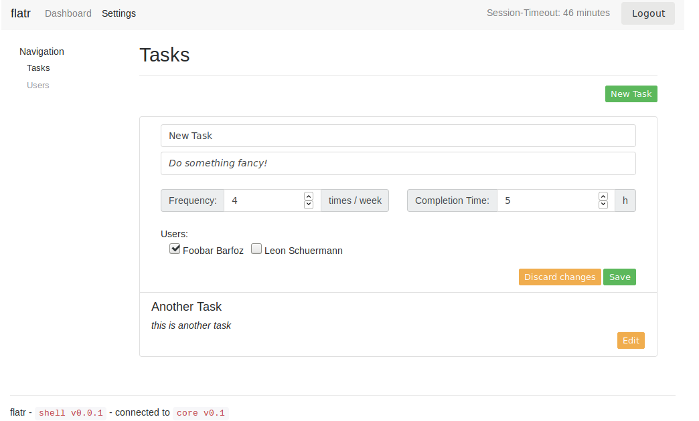
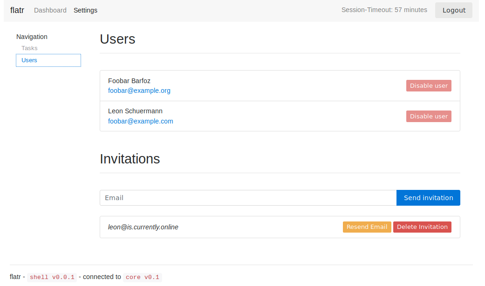
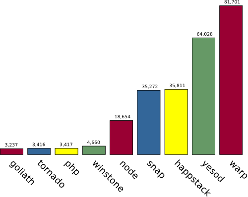

## Motivation

- we both live in shared flats
- these get pretty messy from time to time
- old solution don't work very well

Disadvantages of regular cleaning schedules:

- missing overview
- requires a pen on hand
- can't be checked remotely
- _"I'll do it Tomorrow / on Sunday!"_
- static


The solution: `flatr`

- portable mobile & web-application
- can be checked from any smartphone
- sends reminders
- tasks need to be done in a short timeframe
- fair distribution of tasks

The basic priciple:

1. A user gets a push notification on their smartphone _(not implemented)_
   - containing a specifc timeframe
2. The task gets done
3. Task gets marked as done in the application

A penalty for overdue tasks could be easily introduced


Our system is highly configurable:

- Title
- Description
- Frequency in times / week
- Completion time in hours
- Users per Task

Task overview can be printed as PDF (through the browser print menu)


To prevent unauthorized access, we have setup an invite system

- not everyone should be able to join a flat
- first user can invite other users
- these users get a Email with an invite link
- then they are able to signup for a new account

## Screenshots:







## Project organization

|                     |                                                                |
|---------------------+----------------------------------------------------------------|
| GitHub organisation | [github.com/flatrapp](https://github.com/flatrapp)             |
| API doc in `RAML`   | [flatrapp.github.io/api](https://flatrapp.github.io/api)       |
| Core                | [github.com/flatrapp/core](https://github.com/flatrapp/core)   |
| Shell               | [github.com/flatrapp/shell](https://github.com/flatrapp/shell) |


## Backend

### Technologies

- Haskell
- SQLite
- Nix

Why nix as a build tool - and not stack or cabal?

- If `nix-build` works once, it always works
- Handles ALL dependencies, even C libraries and system packages

Haskell

- Advanced strong typesystem
- Statically typed
- Compiled
- => safe
- Fast
- pure



No `null` or `undefined`

```haskell
foo :: Maybe a
foo = ??

test (Just bar) = print bar
test Nothing    = print "Not there"
```

You can have trust in your software

- compiles => doesn't crash
- works & refactor => still works


Runtime problems:

- inverted if conditionals
- mail library couldn't handle TLS


```haskell
-- sqlAssertIsNotThere
case mEntity of
  Nothing -> errorJson errStatus
  Just _entity -> return ()
```

```diff
-userIsVerified = isJust . userVerifyCode
+userIsVerified = isNothing . userVerifyCode
```

```diff
-            if hashedPw == userPassword user then do
+            if hashedPw /= userPassword user then do
```

----

Parser of json fails if schema is invalid or conditions don't match

```bash
$ http POST localhost:8080/users email="foobarexample.org" firstName="Daniel" lastName="Schäfer" absent:=false password="ifot" 
HTTP/1.1 400 Bad Request
Access-Control-Allow-Origin: *
Content-Type: application/json; charset=utf-8
Date: Tue, 27 Mar 2018 04:11:29 GMT
Server: Warp/3.2.13
Transfer-Encoding: chunked
```

```json
{
    "error": {
        "code": "bad_request",
        "message": "Failed to parse json: Error in $: email does not match required regex."
    }
}
```

---

Json objects

```haskell
data Registration =
    Registration { email          :: Maybe Text
                 , firstName      :: Text
                 , lastName       :: Text
                 , password       :: Text
                 , invitationCode :: Maybe Text
                 , absent         :: Bool
                 } deriving (Show, Generic)
```

## Frontend

- Using Bootstrap v4 for best UI experience
- Implements `flatr` `JSON-API` according to specification
- Reference implementation
- Should work in any modern browser (uses ES5)


We use elm-lang:

- Completely pure functional language
- Strong typesystem
- Compiles to JavaScript
- Extremly fast
- Very similar to Haskell


Benefits of using `Elm`

- If it compiles, it works!
- A function with the same input will produce the same output
- Build the HTML with Elm functions
- Immutable state handling
- Clear and obvious data flow

----

Typesafety in `HTML`:

```haskell
view : Html msg
view =
  Grid.container []
    [ Grid.row []
      [ Grid.col []
        [ text "This is valid!"
        ]
      ]
    ]
```

This will not compile, because a Grid has to contain rows of columns:

```haskell
view : Html msg
view =
  Grid.container []
    [ Grid.col []
      [ Grid.row []
        [ text "This is invalid!"
        ]
      ]
    ]
```

Disadvantages of using `Elm`

- Fairly young language, still developing
- No widespread usage, less support
- Requires to relearn basic programming concepts
- Takes long to get used to
- Not made for _rapid prototyping_


Should you choose Elm?

- Yes
  - If you like stable software that has few bugs
  - If you like typesafety and a good compiler
  - Want to get desktop-class programming on the web
- No
  - If you're in a hurry
  - If the software is just a prototype
  - If you need to work with a lot of JavaScript code
  - _If you need to do a Web assignment_

## Statistics

Backend:

| Part              | Lines |
|-------------------+-------|
| Haskell Logic     | 947   |
| Imports           | 217   |
| Type declarations | 162   |
| SUM Code          | 1326  |
| Comments          | 79    |
| Blank lines       | 208   |

Frontend:

| Part            | Lines |
|-----------------+-------|
| Elm Logic       | 837   |
| API Calls       | 930   |
| HTML Components | 1853  |
| SUM             | 3620  |


## TODO & Future Plans


TODO:

- Sending Emails is still buggy (doesn't work if we try to link statically and the c libraries aren't properly linked)
- Further improve the tasks assignment algorithm


Future Plans:

- Create a Android & iOS native App
- Add more modules
  - Shopping List
  - Expenses

----

This report is free & open source (CC BY-SA 4.0)

Download sources at [https://github.com/flatrapp/documentation](https://github.com/flatrapp/documentation)
